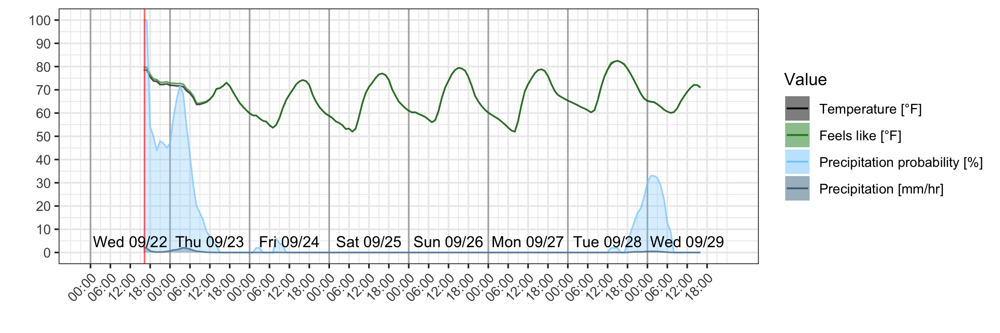

# forecast

This script generates a png of the week's forecast.

[Powered by Dark Sky](https://darksky.net/poweredby/ "Dark Sky")

### Prerequisites
1. A Dark Sky API key. You can register [here](https://darksky.net/dev).
2. python3 and modules `requests` and `json`
3. R libraries `ggplot2`, `anytime`, and `jsonlite`

### Usage

1. Clone this repo

   `git clone https://github.com/johnmatter/forecast`

   `cd forecast`

2. Create a file called devinfo.json containing your Dark Sky API key, latitude and longitude

   `echo '{"latitude": 72.5, "longitude": -21.4, "apiKey": "abcdefg"}' > devinfo.json`

3. Run the main script.

   `./run.sh`

### TODO:
1. Move everything into a single R or python script
2. Include measured data from past 24 hours in forecast
